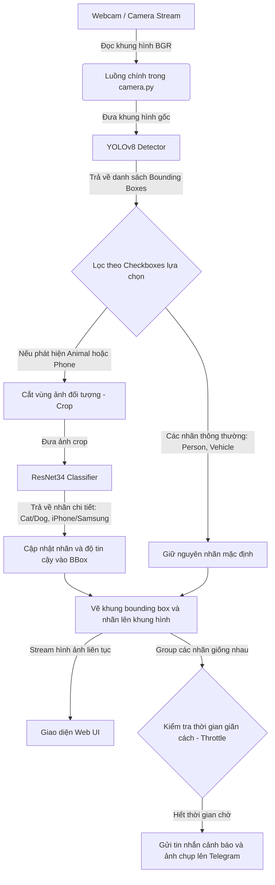

# HƯỚNG DẪN KIẾN TRÚC & LUỒNG HOẠT ĐỘNG CỦA HỆ THỐNG

Tài liệu này mô tả chi tiết các công nghệ sử dụng, cấu trúc thư mục, và luồng dữ liệu của hệ thống nhận diện vật thể kết hợp giữa **YOLOv8**, **ResNet34** và **Telegram Bot**.

---

## 1. Các Công Nghệ Sử Dụng

### Cốt lõi AI & Học sâu
*   **YOLOv8 (Ultralytics)**: Dùng để phát hiện vật thể thời gian thực từ webcam. YOLOv8 định vị nhanh chóng tọa độ bounding box của các vật thể thuộc tập dữ liệu COCO (như `person`, `car`, `dog`, `cat`, `cell phone`).
*   **ResNet34 (PyTorch/Torchvision)**: Dùng làm bộ phân loại chi tiết (Fine-grained Classifier). Khi YOLO phát hiện các nhóm vật thể lớn (như `animal` hoặc `phone`), vùng ảnh tương ứng sẽ được cắt ra (crop) và đưa qua ResNet34 để phân loại chi tiết hơn (như Chó/Mèo, iPhone/Samsung).

### Lập trình Backend & Web Server
*   **FastAPI**: Web framework hiệu năng cao bằng Python để xây dựng các API điều khiển camera, thiết lập cấu hình nhãn nhận diện, và stream video trực tiếp qua giao thức Multipart.
*   **OpenCV (cv2)**: Trích xuất khung hình từ webcam, vẽ khung bounding box, xử lý cắt ảnh đối tượng (crop), và encode hình ảnh dạng JPEG.

### Giao diện Người dùng (Frontend)
*   **HTML5 / JavaScript (Vanilla)**: Giao diện web tối giản, trực quan và hiện đại. Người dùng có thể bật/tắt nhận diện nhiều nhãn cùng lúc thông qua các Checkbox tương tác và xem stream video thời gian thực.

### Kênh Cảnh báo & Tương tác
*   **Telegram Bot API (`python-telegram-bot` & `requests`)**: Tự động gửi tin nhắn văn bản và hình ảnh chụp thực tế từ camera về nhóm Telegram khi phát hiện vật thể mục tiêu, có cơ chế chống spam (Throttle).

---

## 2. Luồng Hoạt Động của Hệ Thống

Dưới đây là luồng xử lý tuần tự của hệ thống từ lúc Camera ghi hình đến khi gửi cảnh báo Telegram và hiển thị lên giao diện Web:

### Chi tiết luồng xử lý trong mã nguồn:
1.  **Đọc khung hình**: Module `camera.py` đọc dữ liệu ảnh BGR từ Webcam.
2.  **Nhận diện tổng quát (YOLOv8)**:
    *   Khung hình được chuyển qua mô hình YOLOv8n để tìm vị trí các vật thể.
    *   Các vật thể phát hiện được phân nhóm: `person`, `vehicle`, `animal`, `phone`.
3.  **Phân loại chi tiết (ResNet34 Crop)**:
    *   Nếu phát hiện là `animal` hoặc `phone`, hệ thống dựa trên tọa độ bounding box để cắt lấy vùng ảnh chứa vật thể đó.
    *   Vùng ảnh cắt được chuẩn hóa (Resize về 224x224, Normalize theo chuẩn ImageNet) rồi chuyển vào ResNet34 dự đoán.
    *   Nhãn chung (`animal`/`phone`) được thay bằng nhãn phân loại chi tiết (như `Cat`, `Dog`, `iPhone`...) trên giao diện livestream.
4.  **Cảnh báo Telegram**:
    *   Hệ thống nhóm các đối tượng trùng nhãn để thống kê số lượng.
    *   Một tin nhắn văn bản kèm ảnh chụp có vẽ bounding box của camera sẽ được gửi về Telegram thông qua API.
